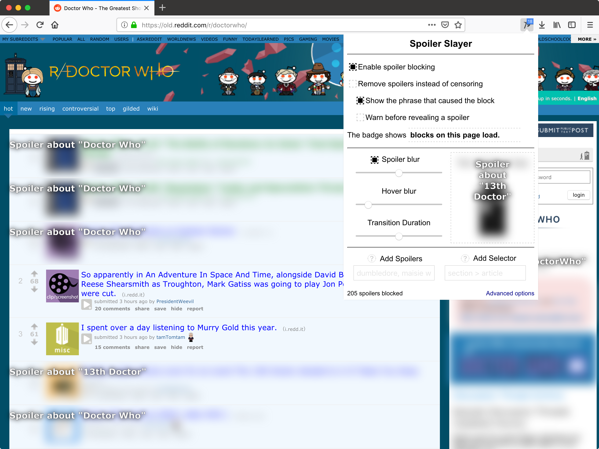

# Spoiler Slayer
Spoiler Slayer is an open source, tracking-free, simple extension for Chrome and Firefox
that blocks TV and movies spoilers on your favorite sites. Subscribe in one
click to public spoilers lists that always stay fresh and make sure no spoilers
slip by, or use the advanced settings to fine tune which
spoilers to block on what sites.

## Available for Chrome and FireFox

Spoiler Slayer includes out of the box support for many popular sites
including Facebook, Reddit, Twitter, Tumblr, YouTube, and Gizmodo; and it's
easy to add more.

Settings allow users to customize the blocking experience with 3 modes:
* Censor - Hides potential spoilers under a black censor bar
* Blur - Blurs out potential spoilers
* Remove - Removes spoilers completely from the page as if they were never there

Other features include:
* Imports, exports, and subscriptions - Create your list of spoilers or sites and share it with the world!
* Spoiler blur intensity - Blur spoilers to oblivion, or keep them just under legible
* Reveal on hover or click - Feeling brave? Spoiler Slayer can reveal
the spoiler when you hover over or click on the censored area
* RegEx support - Anticipate common misspellings of spoilers or only block certain URLs
* Selector helper - It's easy to add new sites with the built-in selector helper, which
highlights items on the page as you type
* Blocked counts - Know how many times you've avoided mild panic!

# Permissions details
No data is sent to any 3rd party servers by this extension. Data is fetched
from GitHub or GitLab when subscribed to lists, but this is not required
for functionality.

## Specific permissions
* "Access your data for all websites" - Needed to be able to match which sites to block spoilers
* "Download files and read and modify the browser’s download history" - Needed to export and import settings to files
* "Access browser tabs" - Needed to display counts and subscription status in Spoiler Slayer badge icon

# Screenshots

## Differences from Game of Spoils
* Removed superfluous fonts and long-winded block notifications (@todo but you can still enable them if you want).
* Simplified and improved UI
* Improved code readability and maintainability
* Switched to modern ES6 and SCSS

### Todo
- [X] Dom change events instead of tracking element content
- [X] Slider for opacity
- - [X] Disable animations checkbox
- [X] Quick add spoiler phrase on popup
- [X] Quick add site on popup?
- [X] New example image
- [X] New icon
- [X] Less awful advanced settings interface
- - [ ] Better text explaining what to do
- - [X] Checkbox to mark spoilers as regexp
- [ ] On install tutorial
- [ ] Ability to disable on certain sites
- [X] Badge / popup counter for session and lifetime blocks
- - [X] Session badge
- - [X] Page badge
- - - [X] Add upper limit
- - [X] Lifetime badge
- - [X] Add config option
- - [ ] Make not flash when loading a site on the same domain (don't think this is possible)
- - [X] Don't update the badge while searching elements. Update it once at the end.
- - [ ] Don't register onTabChange event unless badge count is site / page based
- [X] Live update for settings changes (use on change event)
- - [X] Live updates for no-fx changes
- [X] Settings import and export
- [X] Settings import from gists
- [X] Better way to add new site input in settings (tables are too slow for some reason)
- [ ] Opt-in analytics?
- [X] Remove jQuery req
- [ ] Add one-click legacy mode
- [ ] FF mobile?
- [X] Categorize / tag sites and spoilers to allow export of single collection settings like Harry Potter (possible with exports)
- [ ] Sort sites alphabetically
- [X] Don't block if parent has been glamoured and revealed.
- [X] Set global transition-duration time injected as setting, built into injected CSS and then use that value as a timeout to remove revealed and glamoured-active instead of waiting on unreliable animationend / transitionend
- [X] Add "global" mode that blocks full unknown sites if the body text matches any spoilers. (Not needed. Can just use body as the selector.)
- [X] Don't redraw entire lists when adding / deleting
- [ ] Add flashes to newly added content instead of inputs on options page
- [ ] Localization
- [ ] Don't try to sync settings if too large
- [ ] Use native form validation
- [X] Convert option sections to components
- [X] Use real classes instead of generic objects for spoilers, sites, and subs
- [ ] Clean up popup / content CSS
- [X] Don't export subscription contents?
- [X] Add tests
- [X] Use CSS rules instead of JS to hide / show elements in popup and options (JS is slow.)

### Known Bugs
- [X] Selectors MUST not have plain text nodes or the blocker jumbles the words.
- [X] Example text in popup is slightly off centered
- [X] Hovering over the spoiler text doesn't de-blur the spoiler
- - [X] Neither does clicking on it
- [X] Popup spoiler blur checkbox has bad spacing in FF
- [ ] Retweeted content has the retweeted username bleed through the no-fx censor
- [X] Sometimes there can be embedded blocked elements
- [X] Reddit's up and down arrows don't change color for glamoured content. Probably need to move all the content back to its real parent on reveal.
- [X] The spoiler info pops out instead of fades on reveal in FF
- [X] position: static elements don't work great
- [ ] Changing the badge to all lifetime and all session acts weird until page reload

### How to build from source
1. Clone the repo.
2. Run `npm install` to install dependencies.
3. Run `gulp` to setup watches that will automatically compile any changes you make from the `src` dir to the `build` directory.
4. To test the extension, go to the Chrome Extensions tab, click 'Load unpacked extension', and choose the `build/chrome` or `build/firefox` directory.

Concept originally based on [Game of Spoils](https://github.com/stu-blair/game-of-spoils).