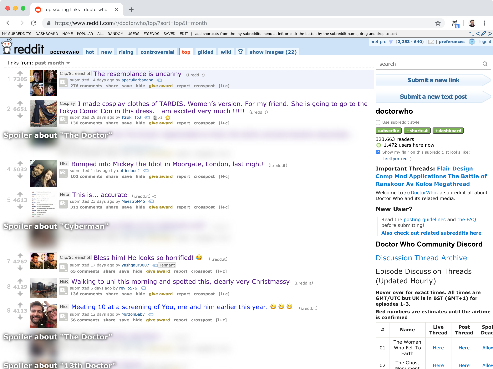
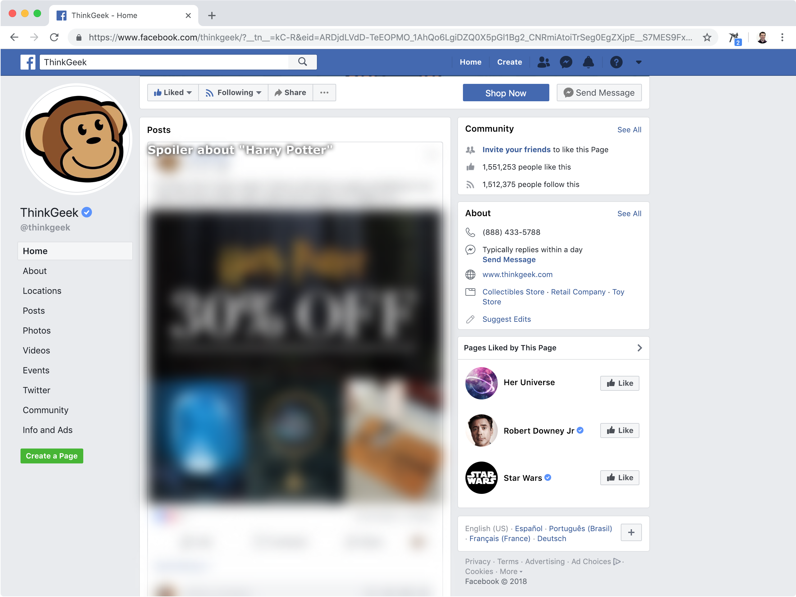
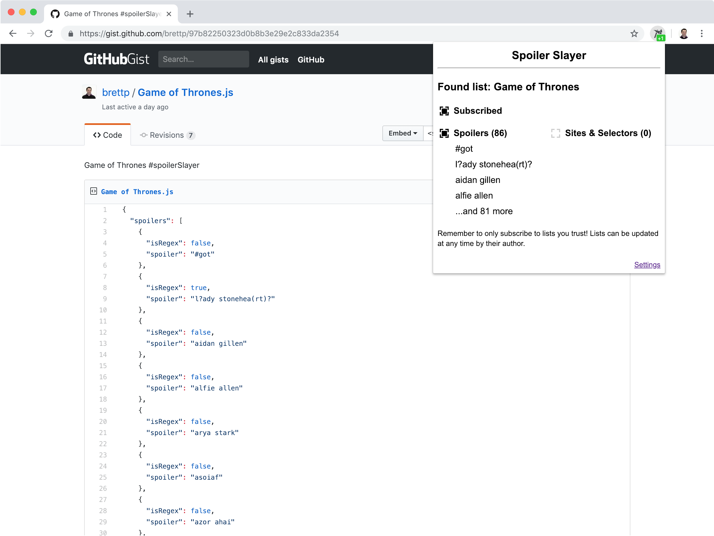
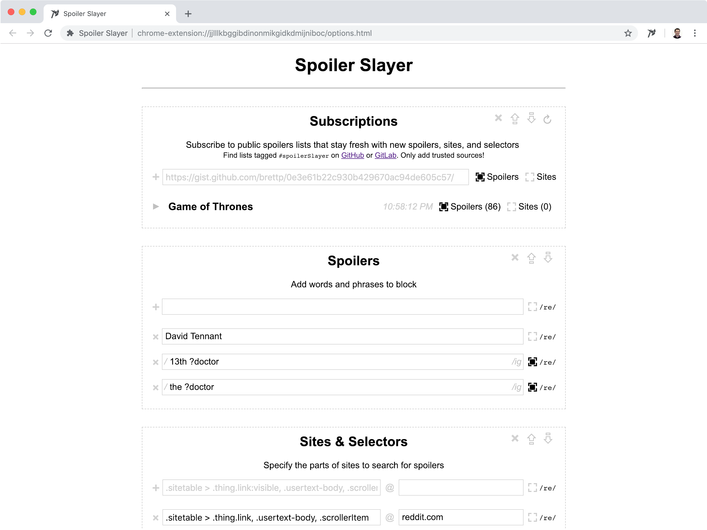

# Spoiler Slayer
Spoiler Slayer is an open source, tracking-free, simple extension for Chrome
and Firefox that blocks TV and movies spoilers on your favorite sites.
Subscribe in one click to public spoilers lists that always stay fresh and
make sure no spoilers slip by, or use the advanced settings to fine tune which
spoilers to block on what sites.

## Available for Chrome and FireFox

Spoiler Slayer includes out of the box support for many popular sites
including Facebook, Reddit, Twitter, Tumblr, YouTube, and Gizmodo; and it's
easy to add more.

Settings allow users to customize the blocking experience with 3 modes:
* Censor - Hides potential spoilers under a black censor bar
* Blur - Blurs out potential spoilers
* Remove - Removes spoilers completely from the page as if they were never there

Other features include:
* Imports, exports, and subscriptions - Create your list of spoilers or sites and share it with the world!
* Spoiler blur intensity - Blur spoilers to oblivion, or keep them just under legible
* Reveal on hover or click - Feeling brave? Spoiler Slayer can reveal
the spoiler when you hover over or click on the censored area
* RegEx support - Anticipate common misspellings of spoilers or only block certain URLs
* Selector helper - It's easy to add new sites with the built-in selector helper, which
highlights items on the page as you type
* Blocked counts - Know how many times you've avoided mild panic!

# Permissions details
No data is sent to any 3rd party servers by this extension. Data is fetched
from GitHub or GitLab when subscribed to lists, but this is not required
for functionality.

## Specific permissions
* "Access your data for all websites" or "Read and change all your data on the websites you visit" -
   Needed to be able to match which sites to block spoilers
* "Download files and read and modify the browser’s download history" or "Manage your downloads" -
   Needed to export and import settings to files
* "Access browser tabs" - Needed to display counts and subscription status in Spoiler Slayer badge icon

# Screenshots

# Building From Source
1. Clone the repo.
2. Run `npm install` to install dependencies.
3. Run `gulp` to setup watches that will automatically compile any changes you make from the `src` dir to the `build` directory.
4. Tutorial images built by taking screenshots with Chrome at 1280x800 (2560x1600 native), then:
   1. `mogrify -resize 50%  *`
   2. `optipng *`
5. Chrome:
   1. Go to the Chrome Extensions tab, click 'Load unpacked extension', and choose the `build/chrome` directory.
6. Firefox
   1. Go to `about:debugger` and click `Enable add-on debugging`, then `Load Temporary Add-on` and choose any file within the `build/firefox` directory.
7. Microsoft Edge
   1. Not currently supported pending Edge's full and correct implementation of the [browser extension API](https://developer.mozilla.org/en-US/docs/Mozilla/Add-ons/WebExtensions), HTML 5, CSS 3, and ES6.
8. Microsoft Internet Explorer
   1. No.

Concept originally based on [Game of Spoils](https://github.com/stu-blair/game-of-spoils).